  

 

  
  
  
  
  
  
  
  
   
  
  
  
  
  
  
   
  
  
  
  
  
  
  
  
  
  
   
  
  
  
  
  
  

 

## What I work with

| | |
|---|---|
| **Languages** | TypeScript · Python · Java · Swift · Kotlin · C · C++ · Ruby |
| **Web & Data** | HTML · Django · SQL |
| **Platforms** | iOS · Android · Linux |
| **DevOps & Cloud** | Docker · Kubernetes · Terraform · GitHub Actions · AWS · Azure · GCP · Helm · Ansible · Nginx |
| **Infra & Security** | Kubernetes · Terraform · Bug Bounty · OWASP · Burp Suite · Web Security · Penetration Testing · Reverse Engineering |

 

  
    <!-- Замени ссылки на свои, лишние строки удали -->
    <a href="mailto:fryrros@gmail.com">Email</a> ·
    <a href="https://t.me/buencik">Telegram</a> 
  

